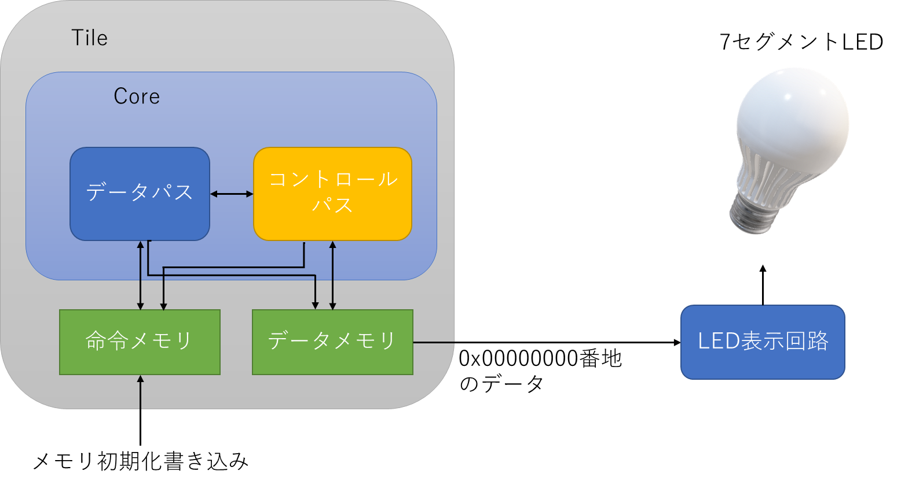

# 概要

RISC-VのRV32IのChisel実装。
現在シングルサイクルなので、パイプライン化する予定。

RV32Iのシングルサイクルrv32i_1stageはriscv-testsのuモード命令はfence.i命令以外の38個の命令をPASSした。

# 全体図

# 今後やること

- パイプライン化
- スーパースカラ
- SMT

# 今後やりたいこと

- CSRの実装
- 分岐予測
